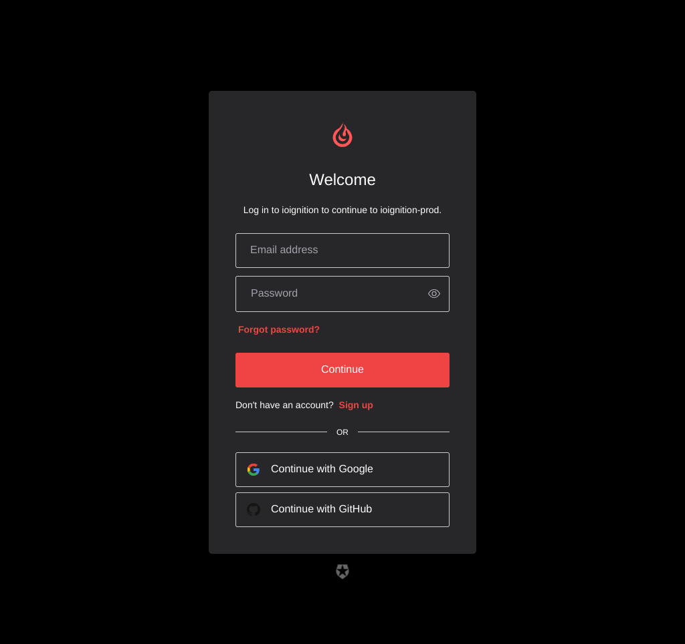
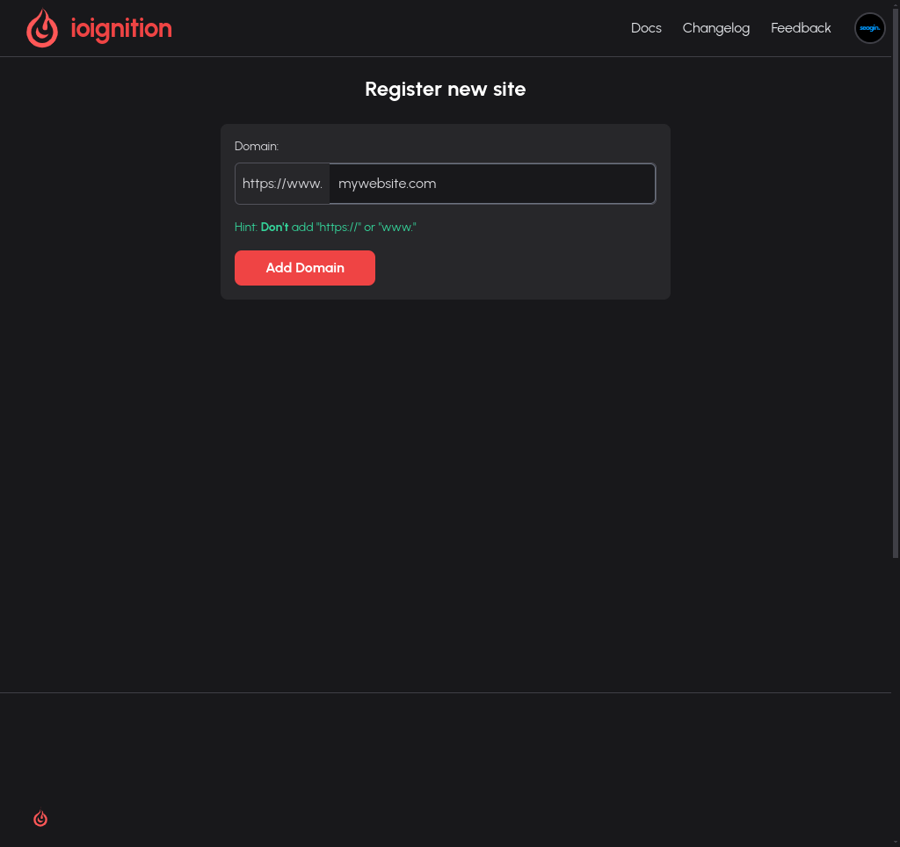
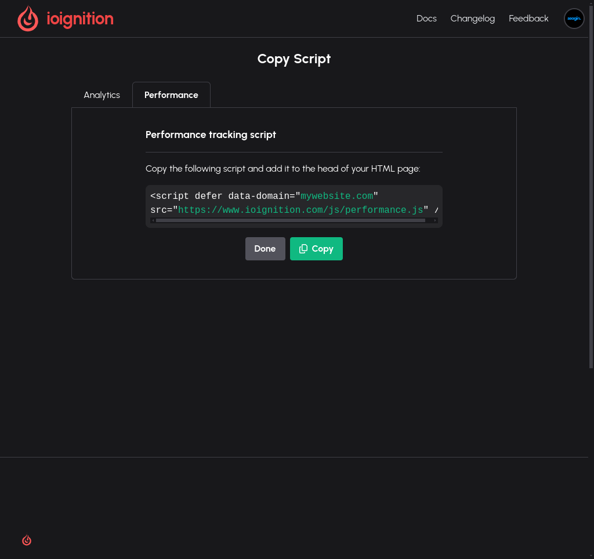

# Getting Started

Getting started is super simple, the steps are exactly the same as for analytics. We'll go over them here anyways.

## Login / SignUp

You can login using Google, Github or Email.

Once logged in, you can move on to step 2. If you are signing up to the platform for the first time. You will be 
directed to the next few steps.

## Adding your site

**Note**: If you wish to get insights on a site you have already added, you can follow the docs [here](../settings/accessing-scripts)

1. After loging in, navigate to `ioignition.com/sites`. Then click on `Add New Site` button on the top right of the page.
2. You'll be presented with the following screen

## Copying the Script

Once you have added the site, you'll be presented with the option of analytics or performance script. Click on the performance tab and 
then click `Copy`

## Finally

Paste the script on between the `<head>...</head>` of your `HTML` and you are done.

## Verifying the script works

If you are like me and would like to know that the script is actually working. Ensure your changes are saved 
and your server has been updated with the latest changes. Visit your site and then head over to ioignition dashboard. Select your site 
and then select `insights` on the navigation bar. You should be able to see your latest performance score.

## Facing issues

If you have trouble with any of the steps above, please email me (support@ioignition.com) and I will assist you as soon as possible.
