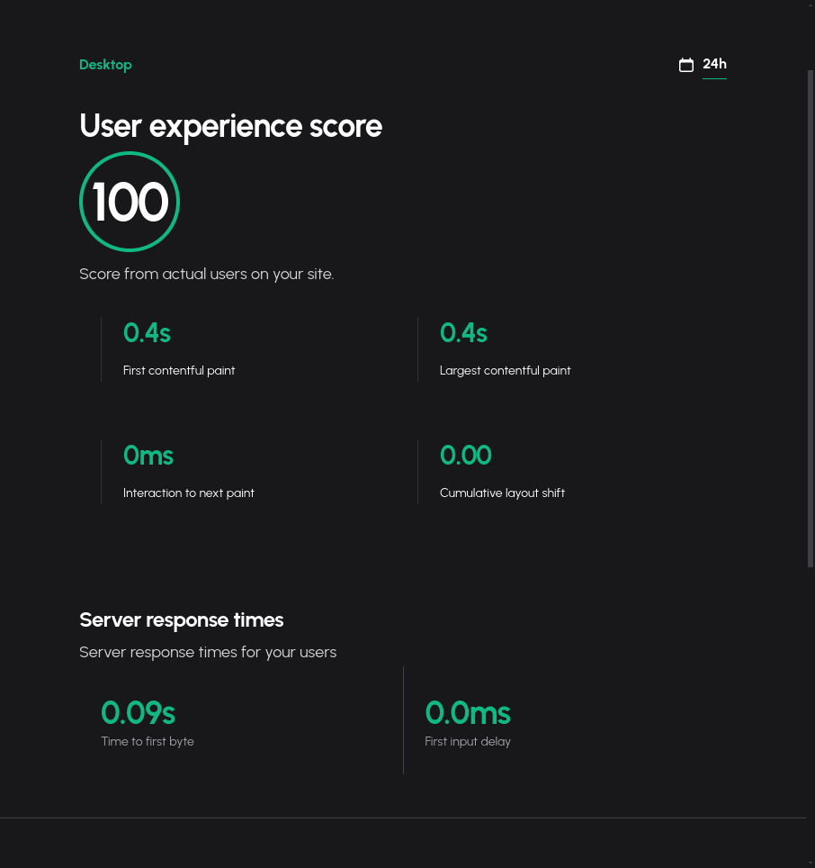

# Real user experience

Unlike most tools out there where you can simulate how your site will behave based on location, 
network speed etc. But there is no replacement to getting actual results from your very own users.

## Getting performance insights by visit

By including a small script from Ioignition, every time a user visits your site. Critical insights regarding the 
performance they experienced can be visualized on the dashboard.

