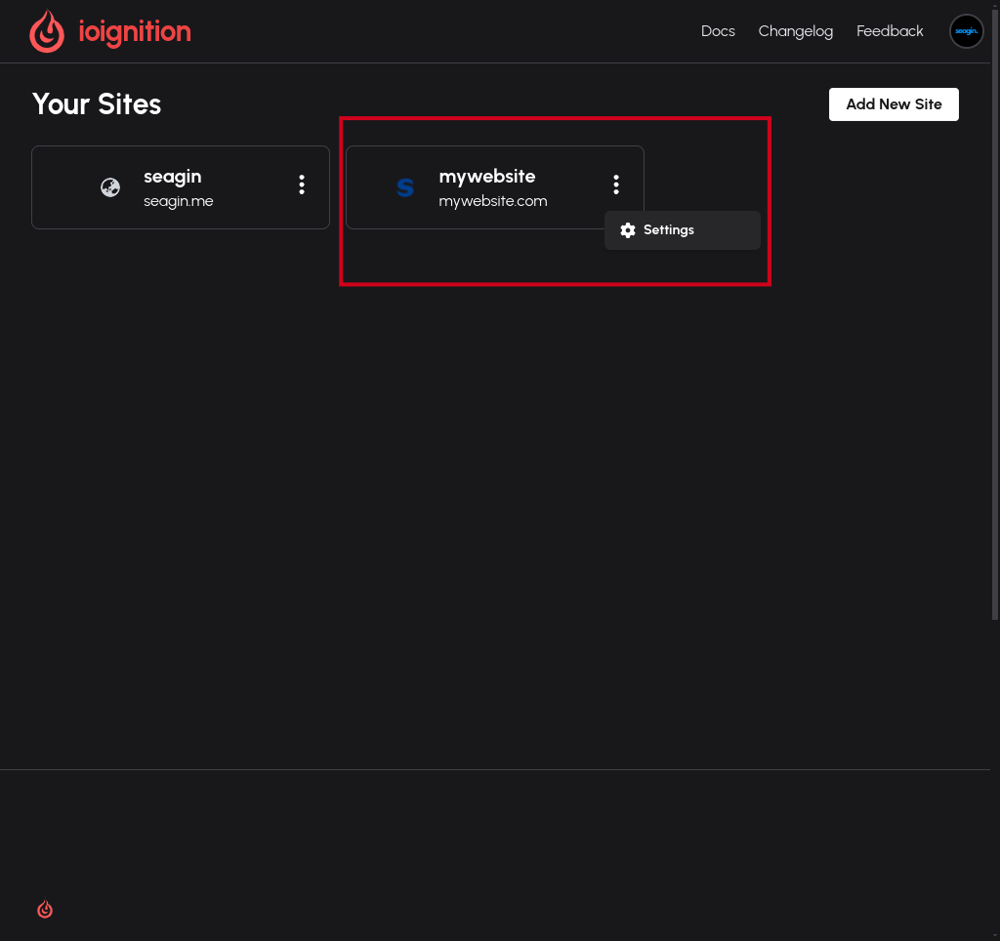
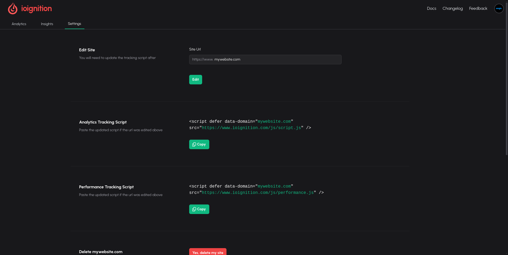

# Accessing scripts

To access the scripts you need to navigate to the settings page. There are two ways to access the settings page:

## 1. Clicking the menu button on the site listing

## 2. By navigating to the settings tab in the site navigation

## Copy the script you need

Once in the settings page you can copy either script as you need.

